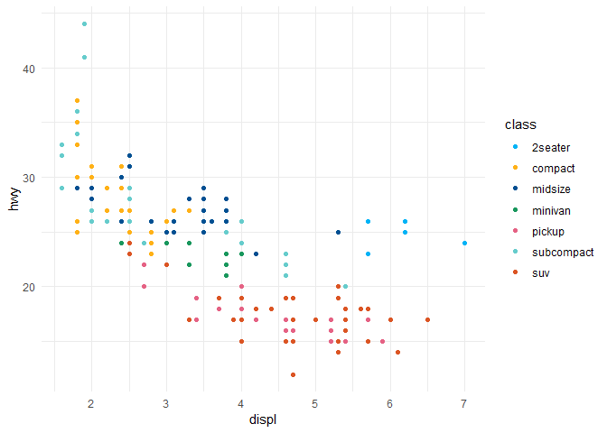

<!-- README.md is generated from README.Rmd. Please edit that file. -->

# rccthemes

RCC themes, scales and geoms for
[ggplot2](https://ggplot2.tidyverse.org).

The longterm goal is to provide ggplot2 themes, scales and geoms that
adhere to the graphic rules at Regional Cancer Centers (RCC) in Sweden.
Currently, RCC scales are implemented.

<mark> Man kan tänka sig att denna funktionalitet ligger i ett eget
paket, såsom detta, eller kanske som en del av något av befintliga
R-paketen på RCC, <https://bitbucket.org/cancercentrum/> </mark>

<mark> John Lövrot, 2019-02-18:  
På RCC använder jag främst ggplot när jag vill göra initiala
utforskningar av dataset eller snabba sammanställningar. För final
publikation/produktion på t.ex. INCA används oft mer skräddarsydda
funktioner. </mark>

<mark> Namnet är inspirerat av
[ggthemes](https://cran.r-project.org/package=ggthemes) </mark>

## Installation

``` r
# install.packages("devtools")
devtools::install_bitbucket("oc1lojo/rccthemes2")
```

## Usage

``` r
library(ggplot2)
library(rccthemes)

theme_set(theme_minimal())

ggplot(mpg, aes(displ, hwy, colour = class)) +
  geom_point() +
  scale_colour_rcc()
```

<!-- -->
